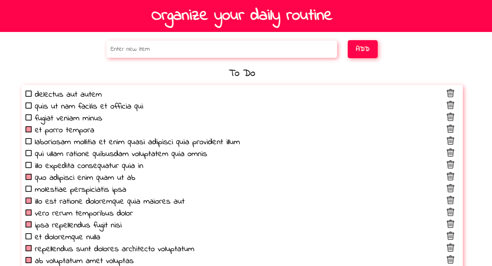

# Simple TODO List app 

## Summary
TodoList app made using native JS and JSON Placeholder fake API.\
I've created this app to train separation of concerns principle in practice. 
and provide a single source of truth for the app.\
The challenge was to configure localStorage and fake API to provide SSOT.

## Features

Add todo item \
Delete todo item \
Mark todo item as completed/incompleted \
See item details

## See deployed project on

[link to github pages](https://olhalatun.github.io/todo-list/)
